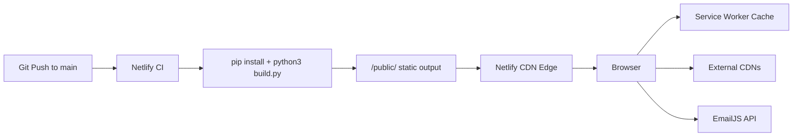
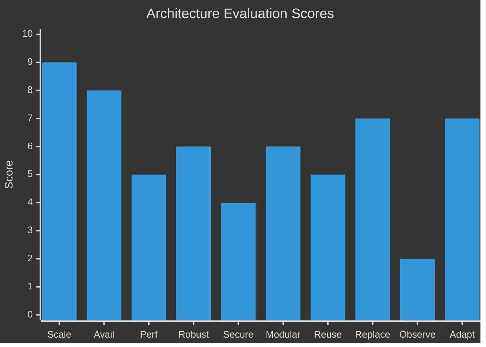

# Architecture Evaluation — Yassien Tawfik Portfolio (V2)

> **Evaluator perspective:** Senior software architect & reliability engineer
> **Date:** 2026-03-11
> **Live URL:** [ytawfik-portfolio.netlify.app](https://ytawfik-portfolio.netlify.app)

---

## 1. Architecture Overview

### Technology Stack

| Layer | Technology |
|---|---|
| **Build system** | Python 3 + Jinja2 (static site generator) |
| **Frontend** | Vanilla HTML5, CSS3 (custom properties), ES6+ JavaScript |
| **CSS framework** | Bootstrap 5.3 (CDN) + custom design system |
| **Icons** | FontAwesome 6.4 (CDN) |
| **Fonts** | Google Fonts — Poppins, Roboto, Mrs Saint Delafield |
| **PDF viewer** | pdf.js 3.11 (CDN) |
| **Email** | EmailJS (client-side API) |
| **Service Worker** | Custom, with build-time precache injection |
| **Hosting** | Netlify (static CDN, CI/CD from Git) |

### Hosting & Deployment Model



- **Deployment:** Fully automated via `git push → Netlify CI → CDN edge`
- **Build:** Single Python script renders 8 Jinja2 templates with JSON data, copies static assets, injects SW precache manifest
- **Runtime:** Zero backend — all logic is client-side or build-time
- **Content management:** JSON files in `content/` directory (CMS-less, git-based)

### High-Level System Architecture

This is a **JAMstack-style static site** with pre-rendered HTML served from a global CDN. The architecture is deliberately simple — no database, no server-side runtime, no API gateway. The only dynamic outbound call from the browser is EmailJS for the contact form.

---

## 2. Attribute Evaluation Table

| Attribute | Score | Analysis | Key Risks | Suggested Improvements |
|---|:---:|---|---|---|
| **Scalability** | **9/10** | Static assets on Netlify CDN scale horizontally with zero effort. No database, no server state, no connection pooling concerns. Content growth (more projects) only increases build-time asset count, not runtime compute. | SW precache list grows linearly with content; very large project lists could cause SW install failure on slow connections. | Limit SW precache to UI shell; lazy-cache project images via fetch handler. |
| **Availability** | **8/10** | Netlify CDN has multi-region redundancy with automatic failover. SW enables offline access for cached pages. No single backend server to become a SPOF. | All images depend on external hosts (postimg.cc, Cloudinary) with no SLA — any host outage = broken images. EmailJS has monthly quota limits. No `onerror` fallback on `` tags. | Self-host critical images or add `onerror` graceful degradation. Migrate contact to Netlify Forms (no external dependency). |
| **Latency / Performance** | **5/10** | Static HTML is fast to TTFB from CDN edge. However: `Cache-Control: no-cache` on _all_ routes (including CSS/JS/images) forces full revalidation every request; 8+ external CDN roundtrips block first render; pdf.js (~1.5MB) loads unconditionally on home page; no image optimization (no WebP, no `srcset`, no `width`/`height`). Google Font import in CSS blocks rendering. | LCP bottleneck from unoptimized external images. CLS from missing image dimensions. TTFB benefit nullified by cache-busting headers on static assets. | Split cache headers (HTML=no-cache; assets=immutable). Self-host Bootstrap/FA. Lazy-load pdf.js. Convert images to WebP + add `srcset`. Preconnect to external origins. |
| **Robustness / Fault Tolerance** | **6/10** | SW provides offline fallback for cached pages (network-first for HTML, stale-while-revalidate for assets). Build is a single Python script — simple means fewer failure modes. | No build-time validation of JSON content schemas. A malformed [projects.json](file:///Users/yassientawfik/Documents/Projects/Software%20Dev/Portfolio%20Website/content/projects.json) silently breaks the build or renders garbage. No image fallback. [gallery_callbacks.js](file:///Users/yassientawfik/Documents/Projects/Software%20Dev/Portfolio%20Website/theme/static/js/utils/gallery_callbacks.js) is dead Dash code shipped to production. Navbar has retry-loop console warnings indicating race conditions. | Add JSON schema validation in [build.py](file:///Users/yassientawfik/Documents/Projects/Software%20Dev/Portfolio%20Website/scripts/build.py). Add global `` error handler. Delete dead code. Fix navbar initialization timing. |
| **Security** | **4/10** | HTTPS enforced by Netlify. Content is static (minimal attack surface vs. dynamic apps). | **Critical:** EmailJS public key + service/template IDs hardcoded in [contact.js](file:///Users/yassientawfik/Documents/Projects/Software%20Dev/Portfolio%20Website/theme/static/js/pages/contact.js) (quota exhaustion, spoofing). Unsanitized `videoUrl` interpolated into `iframe.srcdoc` (XSS). No SRI on 4 external CDN scripts (supply-chain risk). No CSP, X-Frame-Options, X-Content-Type-Options, or Permissions-Policy headers. OG URL still references old Vercel domain. | Migrate to Netlify Forms. Sanitize video URLs (allowlist origin). Add SRI hashes. Add security headers in [netlify.toml](file:///Users/yassientawfik/Documents/Projects/Software%20Dev/Portfolio%20Website/netlify.toml). Fix OG meta URL. |
| **Modularity** | **6/10** | Clear separation: `content/` (data) → `theme/templates/` (presentation) → `scripts/build.py` (orchestration). CSS is well-organized into `base/`, `components/`, `pages/`. JS has `core/`, `pages/`, `utils/`. Jinja2 template inheritance (`base.html` → page templates) is clean. | `build.py` is a 217-line monolith handling _all_ build concerns (data loading, asset copying, SW injection, data transformation, page rendering). Gallery logic is triplicated across 3 JS files. CSS keyframes duplicated across 3 files. | Decompose `build.py` into focused modules (`transform.py`, `sw_builder.py`). Consolidate gallery into a reusable `Gallery` class. Centralize animation keyframes. |
| **Reusability** | **5/10** | Design system tokens (`std-button`, `unified-page-title`) encourage consistency. Jinja2 component includes (`navbar.html`, `project_card.html`, `footer_nav.html`) are reusable. | Gallery navigation logic (animate, keyboard, open/close) is copy-pasted across `credentials.js`, `society.js`, and the dead `gallery_callbacks.js`. No shared gallery module exists. CSS animations are duplicated. | Extract `Gallery` class to `utils/gallery.js`. Consolidate keyframes into `modals.css`. Delete `gallery_callbacks.js`. |
| **Replaceability** | **7/10** | Data-driven architecture makes content changes trivial (edit JSON, push, done). Jinja2 templates are loosely coupled to data. No vendor lock-in on core rendering (Python + Jinja2 are portable). Hosting is standard static — could move to Vercel/Cloudflare Pages trivially. | EmailJS creates vendor dependency for the contact form. External CDN dependencies (Bootstrap, FA, Google Fonts) create coupling to 3rd-party availability. Build script is non-standard — can't use standard SSG plugins or ecosystems. | Migrate to Netlify Forms (eliminates EmailJS dependency). Self-host vendor assets. Consider adopting a standard SSG (11ty, Hugo) for ecosystem benefits if complexity grows. |
| **Observability** | **2/10** | Zero production monitoring. No error tracking (Sentry), no analytics (Plausible/GA), no uptime monitoring, no alerting. Console warnings in navbar.js indicate latent issues that are invisible in production. The only signal of a broken deploy is a user noticing. | A broken deploy, JS crash, or external host outage is completely invisible until reported by a visitor. No way to measure page performance, traffic, or user behavior. | Add Sentry for JS error tracking. Add Plausible for privacy-friendly analytics. Add Netlify deploy notifications. Add uptime monitoring (e.g., UptimeRobot free tier). |
| **Adaptability** | **7/10** | Adding a new page requires 4 straightforward steps (JSON + template + build list + navbar). Adding a project requires editing one JSON file. Category system is extensible (new categories auto-created). CSS custom properties enable theming changes from one file. | No i18n support. No dark/light mode toggle (only dark). No CMS — non-technical users cannot update content without git. Build script doesn't support drafts, scheduled publishing, or content preview. Template system is basic (no markdown content, no plugins). | For current scale, these are acceptable. If requirements grow, consider 11ty for plugin ecosystem, or Netlify CMS for non-technical editing. |

---

## 3. Top Architectural Strengths

- **Radical simplicity:** Zero runtime dependencies (no server, no database, no API) means near-zero operational overhead and failure modes. This is the _ideal_ architecture for a personal portfolio.
- **Global CDN distribution:** Netlify edge caching provides sub-100ms TTFB worldwide. Static sites are inherently the most performant deployment model.
- **Offline capability:** Service Worker with hybrid caching strategy (network-first for HTML, stale-while-revalidate for assets) enables offline access — rare for portfolio sites.
- **Data-driven content:** Clean separation of content (JSON) from presentation (Jinja2) means adding projects/credentials requires zero code changes.
- **Design system discipline:** `std-button` and `unified-page-title` enforce visual consistency and prevent style drift. CSS custom properties centralize theming.
- **Automated CI/CD:** Git push → live in ~60 seconds via Netlify. No manual deployment steps, no staging complexity.
- **Professional visual quality:** Dark theme with curated typography (Poppins/Roboto), subtle micro-animations, and responsive layout delivers a premium portfolio experience.

---

## 4. Most Critical Weaknesses

- **Security headers absent (Critical):** No CSP, X-Frame-Options, X-Content-Type-Options, or Permissions-Policy. The site is vulnerable to clickjacking, MIME sniffing, and has no defense-in-depth against XSS.
- **EmailJS credentials exposed (Critical):** Public key, service ID, and template ID are hardcoded in client-side JavaScript. Anyone can exhaust the monthly email quota or send spoofed messages.
- **XSS vector in video modal (Critical):** `videoUrl` from data attributes is interpolated directly into `iframe.srcdoc` HTML without sanitization. A malicious URL could inject arbitrary scripts.
- **No SRI on external scripts (High):** 4 external scripts (Bootstrap JS, Bootstrap CSS, FontAwesome, EmailJS) loaded without integrity verification. A compromised CDN serves arbitrary code.
- **Cache-busting on ALL routes (High):** `Cache-Control: no-cache, no-store, must-revalidate` applied to CSS, JS, images, and fonts. This completely negates CDN edge caching and SW benefits for immutable assets, creating unnecessary latency on every visit.
- **Zero observability (High):** No error tracking, no analytics, no uptime monitoring. Production failures are invisible.
- **Dead code shipped to production:** `gallery_callbacks.js` (122 lines of Dash framework code) is deployed but never executed. Adds payload and creates maintenance confusion.
- **Triplicated gallery logic (Medium):** Bug fixes must be applied in 3 files. This has already led to divergent implementations.

---

## 5. Priority Improvement Roadmap

### Short-Term (1–2 days) — Security & Quick Wins

| # | Action | Impact | Effort |
|---|---|---|---|
| 1 | Add security headers in `netlify.toml` (CSP, X-Frame-Options, X-Content-Type-Options, Permissions-Policy) | Eliminates 4 vulnerability classes | ~30 min |
| 2 | Sanitize `videoUrl` in `projects.js` — allowlist GitHub user-attachments origin before injection | Closes XSS vector | ~15 min |
| 3 | Add SRI `integrity` attributes to all external `<script>` and `<link>` tags in `base.html` | Eliminates supply-chain risk | ~30 min |
| 4 | Delete `gallery_callbacks.js` — confirmed dead Dash code | Removes payload + confusion | ~5 min |
| 5 | Fix OG meta URL from `vercel.app` → `netlify.app` in `base.html` | Fixes social sharing previews | ~2 min |

### Medium-Term (1–2 weeks) — Performance & Reliability

| # | Action | Impact | Effort |
|---|---|---|---|
| 7 | Split `Cache-Control` headers by asset type: HTML=no-cache, CSS/JS/images=immutable (1yr) | Massive repeat-visit latency improvement | ~1 hr |
| 8 | Self-host Bootstrap + FontAwesome in `theme/static/` | Eliminates 4 CDN roundtrips, enables SRI, improves TTFB | ~2 hrs |
| 9 | Lazy-load pdf.js on Resume modal open (dynamic `<script>` injection) | Saves ~1.5MB on home page load | ~30 min |
| 10 | Add global ` onerror` handler in `base.html` (graceful degradation) | Prevents broken image icons | ~10 min |
| 11 | Add Sentry JS error tracking (free tier) | Production error visibility | ~30 min |
| 12 | Add Plausible analytics (privacy-friendly, ~1KB script) | Traffic + performance insights | ~10 min |
| 13 | Migrate contact form from EmailJS to Netlify Forms | Eliminates exposed credentials, removes 3rd-party dependency | ~2 hrs |

### Long-Term (1–3 months) — Code Quality & Architecture

| # | Action | Impact | Effort |
|---|---|---|---|
| 14 | Consolidate gallery logic into reusable `Gallery` class in `utils/gallery.js` | Eliminates 3x code duplication, single bug-fix location | ~3 hrs |
| 15 | Consolidate duplicated CSS keyframes into `modals.css` only | DRY CSS, consistent animations | ~30 min |
| 16 | Decompose `build.py` into `transform.py` + `sw_builder.py` + orchestrator | Testable modules, separation of concerns | ~3 hrs |
| 17 | Add JSON schema validation to build pipeline (ensure content schema correctness) | Catch content errors at build-time, not in production | ~2 hrs |
| 18 | Limit SW precache to UI shell only; add lazy image caching in fetch handler | Reduces SW install payload as content scales | ~1 hr |
| 19 | Image optimization pipeline — WebP conversion, responsive `srcset`, `width`/`height` attributes | Major LCP/CLS improvement | ~1 day |
| 20 | Consider migration to 11ty or Astro if feature requirements grow beyond current SSG capabilities | Plugin ecosystem, markdown content, i18n, drafts | Variable |

---

## 6. Overall Assessment

````carousel
### Composite Score: **5.9 / 10**

| Dimension | Score |
|---|:---:|
| Scalability | 9 |
| Availability | 8 |
| Latency / Performance | 5 |
| Robustness / Fault Tolerance | 6 |
| Security | 4 |
| Modularity | 6 |
| Reusability | 5 |
| Replaceability | 7 |
| Observability | 2 |
| Adaptability | 7 |

**Arithmetic mean: 5.9**
<!-- slide -->
### Score Distribution


````

> **Bottom line:** The architecture is *fundamentally sound* for a personal portfolio — static sites on CDN edge with CI/CD is the gold standard for this use case. However, the implementation has **critical security gaps** (missing CSP, exposed credentials, XSS vector), a **performance self-inflicted wound** (no-cache on immutable assets), and **total observability blindness**. The short-term fixes are high-impact, low-effort changes that would raise the composite score to ~7.5/10 within a day or two of work.

---

## Live Site Screenshots

````carousel

<!-- slide -->

<!-- slide -->

<!-- slide -->

<!-- slide -->

````

---

*Evaluation based on direct codebase inspection ([build.py](file:///Users/yassientawfik/Documents/Projects/Software%20Dev/Portfolio%20Website/scripts/build.py), [base.html](file:///Users/yassientawfik/Documents/Projects/Software%20Dev/Portfolio%20Website/theme/templates/base.html), [netlify.toml](file:///Users/yassientawfik/Documents/Projects/Software%20Dev/Portfolio%20Website/netlify.toml), [sw.js](file:///Users/yassientawfik/Documents/Projects/Software%20Dev/Portfolio%20Website/static/sw.js), [projects.js](file:///Users/yassientawfik/Documents/Projects/Software%20Dev/Portfolio%20Website/theme/static/js/pages/projects.js), [contact.js](file:///Users/yassientawfik/Documents/Projects/Software%20Dev/Portfolio%20Website/theme/static/js/pages/contact.js), [global.css](file:///Users/yassientawfik/Documents/Projects/Software%20Dev/Portfolio%20Website/theme/static/css/base/global.css), [gallery_callbacks.js](file:///Users/yassientawfik/Documents/Projects/Software%20Dev/Portfolio%20Website/theme/static/js/utils/gallery_callbacks.js)) and live site observation at [ytawfik-portfolio.netlify.app](https://ytawfik-portfolio.netlify.app).*
